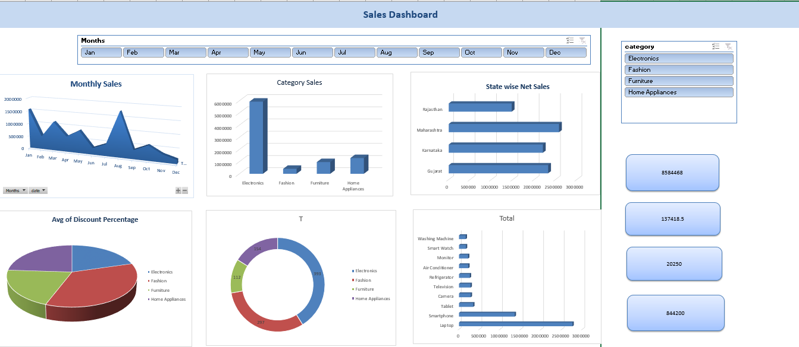

# Sales Dashboard

## Project Overview

This project is an interactive Sales Dashboard created using Microsoft Excel.
It helps analyze sales performance and provides useful business insights
through charts, pivot tables, and interactive filters.

## Project Objectives

- Analyze overall sales performance
- Identify top-performing products
- Analyze sales by category and region
- Track monthly sales trends
- Understand profit and sales performance

## Tools & Techniques Used

- Microsoft Excel
- Pivot Tables
- Pivot Charts
- Slicers
- Conditional Formatting
- Data Cleaning
- Data Analysis

## Dashboard Preview

## Project Files

- `Sales_Dashboard.xlsx` – Complete Excel Sales Dashboard
- `sales-dashboard-preview.png` – Dashboard preview image

## Key Insights

The dashboard provides an easy-to-understand view of sales performance
and helps users identify trends, top products, and business performance.

## Author

Sunigdha Jagtap
